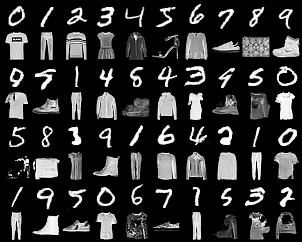

# Synchronize-GAN
Pytorch implementation of paper [SyncGAN: Synchronize the Latent Spaces of Cross-Modal Generative Adversarial Networks](https://ieeexplore.ieee.org/abstract/document/8486594).

## Requirement
Python 3.6
PyTorch >= 1.0.0
NumPy

## Training
```
python SyncGAN.py
```

## Results
First two rows are the sample of ground truth pair, other rows are the results of random pair data generation.

